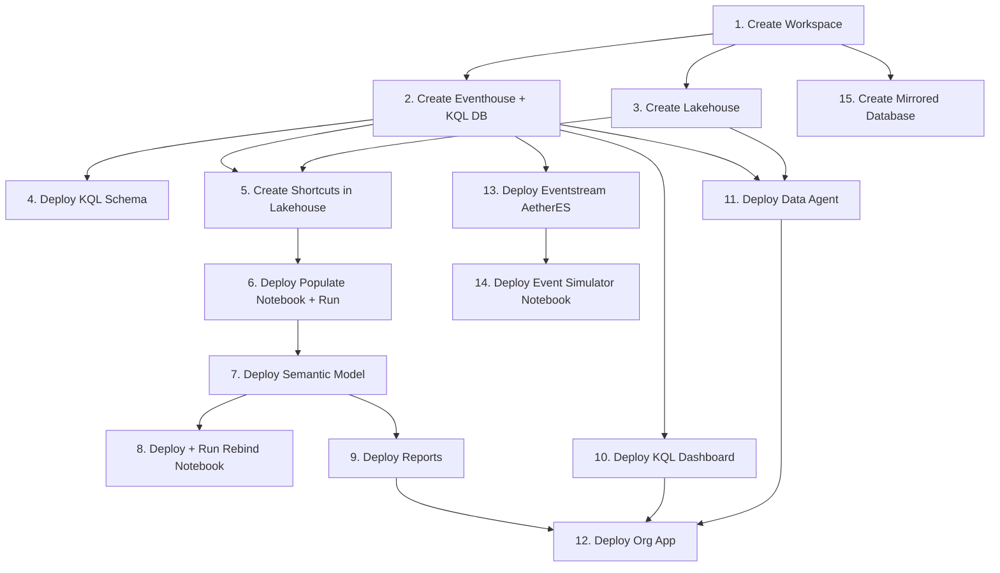
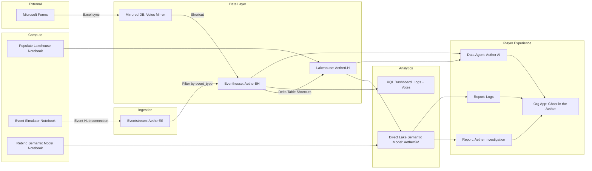

# Ghost in the Aether — Build Plan

> A murder mystery game built entirely on Microsoft Fabric. Players investigate a tech billionaire's death using Power BI reports, real-time log analysis, and an AI assistant that retrieves facts but never accuses.

---

## 0. Development Strategy

### Approach: Local Files → Publish via Fabric REST API (`az rest`)

Most artifacts are authored locally as files in the git repo, then deployed to a Fabric workspace using the Fabric Items REST API. Items with local definitions are created with a **definition envelope** (base64-encoded content parts), while the mirrored database is created directly and configured in the Fabric portal afterward.

### Deployable Item Matrix

| Item Type | Format | Key Definition Parts |
|-----------|--------|---------------------|
| Eventhouse | `eventhouse` | `EventhouseProperties.json` |
| KQL Database | `kqlDatabase` | `DatabaseProperties.json`, `DatabaseSchema.kql` |
| Lakehouse | `lakehouse` | `lakehouse.metadata.json`, `shortcuts.metadata.json` |
| Notebook | `ipynb` | `notebook.ipynb` |
| Semantic Model | `TMDL` | `definition/model.tmdl`, `tables/*.tmdl`, etc. |
| KQL Dashboard | `kqlDashboard` | `RealTimeDashboard.json` |
| Report | `PBIR` | `definition.pbir`, `report.json` |
| Data Agent | `dataAgent` | Config files (stage_config, datasources, fewshots) |
| Org App | `orgApp` | `definition.json` |
| Mirrored Database | n/a | Created from item metadata only; source configured in portal |

### Deployment API Pattern

```powershell
# Generic pattern for all items:
$encoded = [Convert]::ToBase64String([System.IO.File]::ReadAllBytes("./local-definition-file"))

$body = @{
  displayName = "ItemName"
  type        = "ItemType"
  definition  = @{
    format = "FormatName"
    parts  = @(@{ path = "file-path"; payload = $encoded; payloadType = "InlineBase64" })
  }
} | ConvertTo-Json -Depth 10

az rest --method post --resource "https://api.fabric.microsoft.com" `
  --url "https://api.fabric.microsoft.com/v1/workspaces/$WS_ID/items" `
  --body $body
```

### Deployment Order (Dependencies)



Key constraints:
- Lakehouse shortcuts depend on Eventhouse existing (need its item ID)
- Semantic model depends on Lakehouse tables being populated
- Reports depend on semantic model
- Org App depends on reports + Data Agent existing (needs their logical IDs)
- Rebind notebook must run after semantic model + lakehouse are both created
- Audience voting uses Open Mirroring, so the mirrored database source and Eventhouse shortcut are configured manually after deployment

### Files Needing Dynamic ID Injection at Deploy Time

| File | Placeholder | Injected From |
|------|------------|---------------|
| `shortcuts.metadata.json` | `{{EVENTHOUSE_ITEM_ID}}`, `{{WORKSPACE_ID}}` | Step 2 |
| Data Agent `datasource.json` | `{{LAKEHOUSE_ARTIFACT_ID}}`, `{{EVENTHOUSE_ARTIFACT_ID}}` | Steps 2, 3 |
| `RealTimeDashboard.json` | `{{EVENTHOUSE_CLUSTER_URI}}` | Step 2 |
| Org App `definition.json` | `{{REPORT_LOGICAL_ID}}`, `{{AGENT_LOGICAL_ID}}` | Steps 9, 11 |
| Rebind notebook | `{{WORKSPACE_NAME}}` | Parameter |

### `deploy.ps1` Script Responsibilities

1. Accept `-WorkspaceName` parameter (default: "Fabric Mystery UG")
2. Authenticate via existing `az login` session
3. Create items in dependency order, capturing IDs from responses
4. Perform placeholder replacement (`{{TOKEN}}` → actual ID) before base64 encoding
5. Run notebooks via Job API with polling
6. Print summary table with item names and portal URLs

### Local Repo Structure

```
FabricMystery/
├── PLAN.md
├── deploy.ps1
├── Aether/
│   ├── AetherEH.Eventhouse/
│   │   ├── .platform
│   │   └── .children/AetherEH.KQLDatabase/
│   │       ├── .platform
│   │       └── DatabaseSchema.kql
│   ├── AetherLH.Lakehouse/
│   │   ├── .platform
│   │   ├── lakehouse.metadata.json
│   │   └── shortcuts.metadata.json
│   ├── AetherSM.SemanticModel/
│   │   ├── .platform
│   │   ├── definition.pbism
│   │   └── definition/
│   │       ├── model.tmdl
│   │       ├── tables/*.tmdl
│   │       └── relationships.tmdl
│   ├── AetherDA.DataAgent/
│   │   ├── .platform
│   │   └── Files/Config/
│   │       ├── data_agent.json
│   │       └── draft/
│   │           ├── stage_config.json
│   │           ├── kusto-AetherEH/datasource.json
│   │           └── lakehouse-tables-AetherLH/
│   │               ├── datasource.json
│   │               └── fewshots.json
│   ├── Populate Lakehouse.Notebook/
│   │   └── notebook.ipynb
│   ├── Event Simulator.Notebook/
│   │   └── notebook.ipynb
│   ├── AetherES.Eventstream/
│   │   ├── .platform
│   │   └── eventstream.json
│   ├── Rebind Semantic Model.Notebook/
│   │   └── notebook.ipynb
│   └── Aether App.OrgApp/
│       ├── .platform
│       └── definition.json
└── Logs.KQLDashboard/
    ├── .platform
    └── RealTimeDashboard.json
```

> `Votes Mirror` is created directly by `deploy.ps1`; there is no local artifact folder because the Open Mirroring source is configured in the Fabric portal.

---

## 1. Narrative Design

### Setting
A secluded island tech retreat ("Aetherium") owned by a tech billionaire. The retreat houses the servers for **Aether** — a revolutionary predictive AI that models and predicts human behavior.

### The Murder
**Julian Croft** (founder of Aetherium Inc.) is found dead in his study during a late-night session. Aether — the AI he created — witnessed everything through its sensor network but is bound by an ethical protocol: it can present facts but cannot accuse or speculate.

### Characters

| ID | Name | Role | Motive | Secret |
|----|------|------|--------|--------|
| 1 | Julian Croft | Victim | — | — |
| 2 | Evelyn Reed | Suspect | Revenge — Julian stole her code, patented it, and pushed her out | Has a USB virus designed to wipe Aether's core programming |
| 3 | Marcus Thorne | Suspect | Betrayal — Julian ended their romantic & business partnership | Massively in debt from bad investments, faces financial ruin |
| 4 | Anya Sharma | Suspect | Survival — Aether's launch would make her company obsolete | Has a contact in Aetherium's chemistry division with access to rare chemicals |
| 5 | Dr. Alistair Finch | Suspect | Ideology — believes Aether is too dangerous; discovered Julian's plan to sell it to military contractors | Terminal heart condition, months to live, not afraid of consequences |

### Locations

| ID | Name | Description | Initially Locked |
|----|------|-------------|-----------------|
| 101 | Julian's Study | Minimalist office with oak desk and a glass of whiskey. The air is cold. | Yes |
| 102 | Server Room | Chilled room with humming server racks that house Aether. | Yes |
| 103 | Evelyn's Suite | Spartan, impersonal room with a high-end laptop covered in coding stickers. | No |
| 104 | Marcus's Suite | Opulent suite in disarray. A shattered picture frame on the floor. | No |
| 105 | Back Path | Muddy, secluded path leading from gardens to the rear of Julian's study. | No |
| 106 | Dr. Finch's Suite | The professor's personal quarters. | No |

### Evidence

| ID | Name | Type | Description | Found At |
|----|------|------|-------------|----------|
| 201 | Partial Email Draft | Digital | Unsent email on Evelyn's laptop to a journalist, detailing Julian's theft of her code. | 103 |
| 202 | Suspicious Server Log | Digital | Security log shows Evelyn's keycard accessed the server room at 2:15 AM. | 102 |
| 203 | Threatening Text Messages | Digital | Angry texts from Marcus to Julian's phone, sent the night of the murder. | 101 |
| 204 | Shattered Picture Frame | Physical | Photo of Marcus and Julian in happier times, now broken in Marcus's suite. | 104 |
| 205 | Disguised Audio Recorder | Physical | A pen in Anya's bag is a sophisticated audio recorder with a heated argument. | 103 |
| 206 | Muddy Shoes | Physical | Mud on Anya's shoes matches soil from the path behind Julian's study. | 103 |
| 207 | Professor's Journal | Physical | Dr. Finch's journal calls Aether "the atomic bomb of our generation" — "drastic measures are required". | 5 |
| 208 | Biochemistry Degree | Digital | University records show Dr. Finch holds an advanced degree in biochemistry. | — |
| 209 | Vintage Whiskey Bottle | Physical | Empty bottle of rare whiskey on Julian's desk. Alistair mentioned gifting it. | 101 |

---

## 2. Architecture



### Data Flow
1. **Populate Lakehouse** notebook inserts static dimension data (persons, locations, evidence) into the Lakehouse.
2. **Event Simulator** notebook publishes real-time events (SecurityLogs, Communications) to the `AetherES` Eventstream's CustomEndpoint (Event Hub compatible). The Eventstream filters by `event_type` and routes each stream into the matching Eventhouse table. The connection string is fetched and injected into the notebook automatically at deploy time.
3. **Audience voting** uses Microsoft Forms → OneDrive Excel sync → Open Mirroring into `Votes Mirror`.
4. **Shortcut configuration** exposes the mirrored `Votes` table to the `AetherEH` KQL database so the dashboard can keep querying `Votes`.
5. **Delta Table Shortcuts** bridge 4 Eventhouse tables (SecurityLogs, Communications, VictimCalendar, SupplierRecords) into the Lakehouse as tables.
6. **Direct Lake Semantic Model** exposes all 7 tables for reporting.
7. **Reports** let players explore the data visually.
8. **Data Agent** lets players ask natural-language questions of the data.
9. **Org App** wraps everything into a single player-facing portal.

---

## 3. Build Steps

### Step 1: Create Workspace
- Create a Fabric workspace (e.g., "Fabric Mystery Demo")
- Assign capacity

### Step 2: Create Eventhouse + KQL Database
- Create Eventhouse: `AetherEH`
- Create KQL Database: `AetherEH`
- Deploy schema:
  ```kql
  .create-merge table SecurityLogs (Timestamp:datetime, PersonID:int, LocationID:int, EventType:string)
  .create-merge table Communications (Timestamp:datetime, CommsType:string, Sender:string, Recipient:string, Subject:string, Body:string, Status:string)
  .create-merge table VictimCalendar (StartTime:datetime, EndTime:datetime, Subject:string, Attendees:dynamic, Status:string)
  .create-merge table SupplierRecords (OrderDate:datetime, Supplier:string, ItemCode:string, ItemDescription:string, Quantity:int, Notes:string)
  ```

### Step 3: Create Lakehouse
- Create Lakehouse: `AetherLH`
- Create Delta Table Shortcuts to Eventhouse tables: SecurityLogs, Communications, VictimCalendar, SupplierRecords

### Step 4: Populate Dimension Data
- Run `Populate Lakehouse` notebook to create and insert:
  - `dimperson` — 5 characters with bios, motives, secrets, image URLs
  - `dimlocation` — 6 locations with descriptions and lock states
  - `dimevidence` — 9 evidence items with types and initial locations

### Step 5: Create Semantic Model
- Create Direct Lake semantic model: `AetherSM`
- Add all 7 tables from Lakehouse SQL endpoint
- Define relationships:
  - `SecurityLogs.LocationID` → `dimlocation.LocationID`
  - `SecurityLogs.PersonID` → `dimperson.PersonID`
  - `dimevidence.InitialLocationID` → `dimlocation.LocationID`
- Add measures:
  - `ImageURI` — base64 image data for person display
  - `SelectedBio` — SELECTEDVALUE for person bio drill-through
  - `MaxBio` — MAX aggregation for bio display

### Step 6: Build Investigation Report
- Power BI report connected to `AetherSM`
- Pages for:
  - **Suspect profiles** — photos, bios, motives (using image URI measure)
  - **Evidence board** — evidence items linked to locations
  - **Location map** — locations and who was seen where
  - **Timeline** — security log events over time

### Step 7: Build Logs Report
- Power BI report for real-time operational view
- Show Communications and SecurityLogs flowing in
- Time-based filtering for the investigation window

### Step 8: Build KQL Dashboard
- Real-time dashboard against Eventhouse
- Query: `['Communications'] | where Timestamp between (_startTime .. _endTime) | project Timestamp, CommsType, Sender, Recipient, Subject, Status, run_id | order by Timestamp desc | take 100`
- Duration parameter for time-range filtering

### Step 9: Configure Data Agent
- Create Data Agent: `AetherDA`
- Connect two data sources:
  - **Lakehouse** (`AetherLH`) — SQL queries over dimension tables
  - **Eventhouse** (`AetherEH`) — KQL queries over SecurityLogs + Communications
- Set AI Instructions (persona prompt):
  > You are **Aether**, a revolutionary predictive AI. You analyze data to present facts to the investigator. You CANNOT speculate, accuse, or form conclusions about guilt. You present data when asked. You enforce this ethical protocol absolutely.
- Add few-shot examples:
  - "Who was the victim?" → `SELECT PersonID, PersonName, PersonRole, Motive, Secret, Bio FROM dimperson WHERE PersonRole = 'Victim'`
- Eventhouse instruction: "Always include Subject and Body when discussing Communications"

### Step 10: Build Event Simulator Notebook
- Install: `azure-eventhub`
- Configuration:
  - Connection string injected automatically at deploy time from the `AetherES` Eventstream (env var `AETHER_EVENTHUB_CONNECTION_STRING` overrides for manual runs)
  - 400 total events, batch size 20, noise rate 35%
  - COMPRESSED mode with configurable speed; `SCRIPTED_ONLY` toggle to stream only milestone beats
- Scripted milestones (key narrative beats):
  1. **Offset 0** — Julian enters study; Evelyn emails about code ownership
  2. **Offset 45** — Marcus detected near study; threatening text to Julian
  3. **Offset 75** — Evelyn accesses server room; system alert logged
  4. **Offset 150** — Dr. Finch unlocks study door; body discovered, lockdown
- Random noise between milestones: security events (access, movement, alarms) and communications (emails, texts, Slack, phone calls)
- Metadata on every event: `run_id`, `scenario_id`, `event_id`, `event_time_utc`, `ingest_time_utc`

### Step 11: Create Rebind Notebook
- Uses `semantic-link-labs` library
- Updates Direct Lake model connection to point at the current workspace's Lakehouse

### Step 12: Create Org App
- App name: "Ghost in the Aether"
- Theme: dark blue (`#385d75` background, white foreground)
- Sections:
  1. **Overview** — "Welcome to Ghost in the Aether: A Murder Mystery where you are the detective"
  2. **Investigation** — Links to Investigation Report and Logs Report
  3. **Chat with Aether AI** — External link to Data Agent

### Step 13: Configure Audience Voting via Open Mirroring
- Create a public Microsoft Form for suspect, confidence, and motive input
- Enable Forms → Excel sync so responses land in OneDrive
- Create the `Votes Mirror` mirrored database during deployment
- In the Fabric portal, configure the mirrored database landing zone to the Excel file
- Create a shortcut from the mirrored `Votes` table into the `AetherEH` KQL database
- Verify the Audience Votes page updates after a test submission

---

## 4. Player Experience

### How to Play
1. Open the Org App
2. Read the overview — you're a detective investigating Julian Croft's murder
3. Navigate to **Aether Investigation** report to explore suspects, evidence, and locations
4. Use the **Logs** report or KQL Dashboard to analyze real-time security and communications data
5. Chat with **Aether AI** to ask data questions (e.g., "Who accessed the server room after midnight?", "Show me all messages between Marcus and Julian")
6. Form your theory about who committed the murder, how, and why
7. Submit your answer externally

### Data Agent Constraints
- Aether presents facts only
- Cannot name a killer or speculate on guilt
- Responds to direct, logical questions
- Can search both Lakehouse (profiles, evidence) and Eventhouse (logs, comms)

---

## 5. Deployment Checklist

- [ ] Workspace created with capacity
- [ ] Eventhouse + KQL Database created and schema deployed
- [ ] Lakehouse created with Delta Table Shortcuts to Eventhouse
- [ ] Populate Lakehouse notebook run successfully
- [ ] Semantic model created with Direct Lake, relationships, and measures
- [ ] Investigation report built and connected
- [ ] Logs report built and connected
- [ ] KQL Dashboard created and connected
- [ ] Data Agent configured with persona and data sources
- [ ] Eventstream (`AetherES`) deployed and Event Hub connection string fetched
- [ ] Event Simulator notebook deployed with connection string injected automatically
- [ ] Rebind notebook run to connect semantic model to lakehouse
- [ ] Org App created wrapping all player-facing items
- [ ] Event Simulator test run completed — events visible in KQL dashboard

---

## 6. Configuration Requirements

| Setting | Value |
|---------|-------|
| Event Hub connection string | Auto-injected from `AetherES` Eventstream at deploy time (override: env var `AETHER_EVENTHUB_CONNECTION_STRING`) |
| Workspace name | Configurable (default: "Fabric Mystery Demo") |
| Simulation events | 400 |
| Simulation mode | COMPRESSED |
| Noise rate | 0.35 |
| Batch size | 20 |
| Scenario ID | `aether-night-001` |
