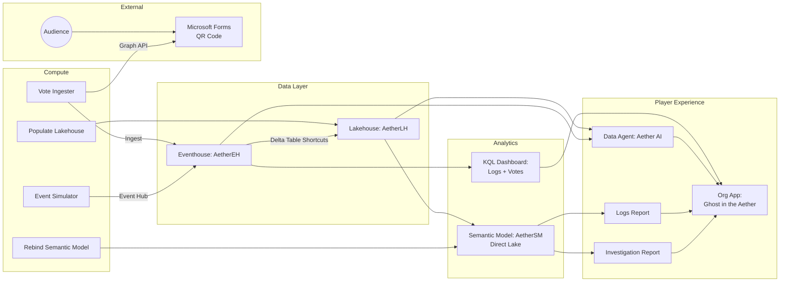
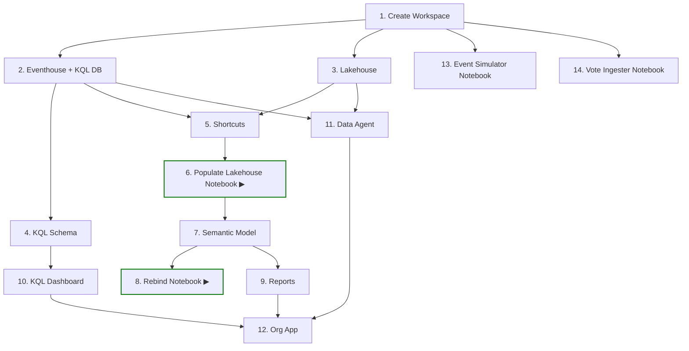

# Ghost in the Aether

> A murder mystery game built entirely on Microsoft Fabric. Players investigate a tech billionaire's death using Power BI reports, real-time log analysis, and an AI assistant that retrieves facts but never accuses.

## Prerequisites

| Requirement | Notes |
|-------------|-------|
| **Microsoft Fabric capacity** | F2 or higher (or Trial capacity) |
| **Azure CLI** | `az` installed and authenticated (`az login`) |
| **PowerShell 7+** | Cross-platform; ships with Windows |
| **Fabric permissions** | Ability to create workspaces on the target capacity |
| **Microsoft Forms** | A public form for audience voting (optional) |

## Deployment

The included `deploy.ps1` script creates all Fabric items in the correct dependency order using the Fabric REST API. No manual portal clicks required.

### Quick Start

```powershell
# Clone the repo
git clone https://github.com/MitchSS/FabricMystery.git
cd FabricMystery

# Deploy to a new workspace (uses your existing az login session)
.\deploy.ps1 -WorkspaceName "Fabric Mystery Demo" -CapacityId "<your-capacity-guid>"
```

### Parameters

| Parameter | Required | Default | Description |
|-----------|----------|---------|-------------|
| `-WorkspaceName` | No | `"Fabric Mystery UG"` | Target workspace name. Created if it doesn't exist. |
| `-CapacityId` | No* | `""` | Fabric capacity GUID. *Required when creating a new workspace. |

### What the Script Does (14 Steps)

| Step | Action |
|------|--------|
| 1 | Create or resolve workspace |
| 2 | Create Eventhouse + KQL Database (`AetherEH`) |
| 3 | Create Lakehouse (`AetherLH`) |
| 4 | Deploy KQL schema (SecurityLogs, Communications, VictimCalendar, SupplierRecords, Votes) |
| 5 | Create Delta Table shortcuts (Eventhouse → Lakehouse) |
| 6 | Deploy & run Populate Lakehouse notebook (dimension data) |
| 7 | Deploy Semantic Model (`AetherSM` — Direct Lake) |
| 8 | Deploy & run Rebind Semantic Model notebook |
| 9 | Deploy Reports *(skipped — PBIR definitions not yet authored)* |
| 10 | Deploy KQL Dashboard (Security Logs, Communications, Audience Votes) |
| 11 | Deploy Data Agent (`AetherDA`) |
| 12 | Deploy Org App (`Aether App`) |
| 13 | Deploy Event Simulator notebook |
| 14 | Deploy Vote Ingester notebook |

### Post-Deployment Setup

Once the script completes:

1. **Event Simulator** — Open the notebook in Fabric, set the `AETHER_EVENTHUB_CONNECTION_STRING` environment variable, then run it to start streaming events.

2. **Vote Ingester** (optional) — Create a public Microsoft Form with:
   - Question 1: "Who did it?" (choice: Evelyn Reed, Marcus Thorne, Anya Sharma, Dr. Alistair Finch)
   - Question 2: "Confidence?" (rating 1–5)
   - Question 3: "What was the motive?" (free text)
   
   Copy the Form ID into the notebook's `FORM_ID` parameter and run it when audience voting opens.

3. **Open the App** — Navigate to the workspace in the Fabric portal and launch "Aether App" for the player experience.

## Redeployment & Cleanup

The script does **not** support incremental updates — it expects a fresh workspace. To redeploy:

```powershell
# Delete the workspace in the Fabric portal (or via API), then re-run:
.\deploy.ps1 -WorkspaceName "Fabric Mystery Demo" -CapacityId "<your-capacity-guid>"
```

## Troubleshooting

| Issue | Fix |
|-------|-----|
| `az rest` returns 401 | Run `az login` to refresh your token |
| Workspace creation fails | Ensure you have capacity admin rights and the `-CapacityId` is correct |
| Notebook job times out | Check capacity isn't throttled; default timeout is 10 minutes |
| Shortcuts fail | Eventhouse must be fully provisioned (script waits 5s, but busy capacities may need longer) |
| Vote Ingester gets 403 from Graph | The notebook identity needs `Forms.Read.All` consent in Entra ID |

## Architecture



## Deployment Dependencies



> ▶ indicates notebooks that are executed during deployment. All other notebooks are deployed but run manually by the presenter.
