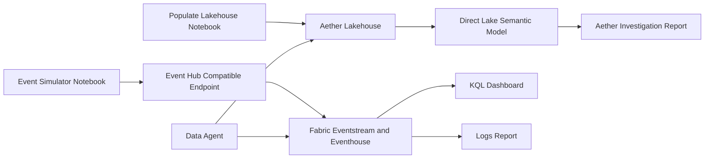

# Fabric Mystery: Ghost in the Aether

An end-to-end Microsoft Fabric demo experience that combines narrative investigation, semantic modeling, and real-time analytics.

The project theme is a murder mystery set in a tech retreat. Users investigate evidence through reports, logs, and a constrained AI assistant persona (Aether) that can retrieve facts but should not speculate or accuse.

## Solution Overview

This repository packages a complete Fabric solution with:

- A Fabric Org App shell for navigation and user experience.
- A Lakehouse with narrative data entities.
- An Eventhouse/KQL layer for log-style analysis.
- A Direct Lake semantic model.
- Power BI reports for investigation and operations/log views.
- A Data Agent configuration for AI-assisted query workflows.
- Notebooks for data population, model rebinding, and real-time simulation.

## Architecture

## Key Artifacts

- Org app: [Aether/Aether App.OrgApp/definition.json](Aether/Aether%20App.OrgApp/definition.json)
- Lakehouse metadata: [Aether/AetherLH.Lakehouse/lakehouse.metadata.json](Aether/AetherLH.Lakehouse/lakehouse.metadata.json)
- Eventhouse metadata: [Aether/AetherEH.Eventhouse/EventhouseProperties.json](Aether/AetherEH.Eventhouse/EventhouseProperties.json)
- Semantic model root: [Aether/AetherSM.SemanticModel/definition/model.tmdl](Aether/AetherSM.SemanticModel/definition/model.tmdl)
- Investigation report: [Aether Investigation.Report/definition/report.json](Aether%20Investigation.Report/definition/report.json)
- Logs report: [Logs.Report/definition/report.json](Logs.Report/definition/report.json)
- KQL dashboard: [Logs.KQLDashboard/RealTimeDashboard.json](Logs.KQLDashboard/RealTimeDashboard.json)
- Data Agent draft config: [Aether/AetherDA.DataAgent/Files/Config/draft/stage_config.json](Aether/AetherDA.DataAgent/Files/Config/draft/stage_config.json)

## Notebook Assets

- Baseline data load: [Aether/Populate Lakehouse.Notebook/notebook-content.py](Aether/Populate%20Lakehouse.Notebook/notebook-content.py)
- Semantic model connection update: [Aether/Rebind Semantic Model.Notebook/notebook-content.py](Aether/Rebind%20Semantic%20Model.Notebook/notebook-content.py)
- Real-time event simulator: [Aether/Event Simulator.Notebook/notebook-content.py](Aether/Event%20Simulator.Notebook/notebook-content.py)

## Real-Time Simulator (MVP)

The simulator notebook publishes events to an Event Hub compatible endpoint and is designed for demo-scale throughput.

Current capabilities:

- Hybrid event generation (scripted milestones plus random noise).
- Two event families: SecurityLogs and Communications.
- Replay metadata fields: run_id, scenario_id, event_id, event_time_utc, ingest_time_utc.
- Batched sends with progress output and run summary.
- WebSocket transport with retry for more resilient notebook egress.

### Required Configuration

Set this environment variable in your notebook runtime before running the simulator:

- AETHER_EVENTHUB_CONNECTION_STRING

Do not commit secrets into notebook source.

### Suggested First Run

1. Run the install/import cells.
2. Set AETHER_EVENTHUB_CONNECTION_STRING.
3. Keep default demo settings (COMPRESSED mode, small batch size).
4. Start the publish cell.
5. Verify records appear in KQL dashboard and Eventhouse queries.

## KQL Dashboard Notes

The dashboard query has been updated to use the built-in duration parameters (_startTime, _endTime) so the time range filter now drives the Communications table view in near-real-time.

File: [Logs.KQLDashboard/RealTimeDashboard.json](Logs.KQLDashboard/RealTimeDashboard.json)

## Getting Started

1. Import or open this repository in a Fabric-aware VS Code workspace.
2. Validate artifact bindings (workspace IDs, lakehouse, and Eventhouse references).
3. Run baseline setup notebook to populate narrative data.
4. Rebind Direct Lake semantic model if required.
5. Open reports and KQL dashboard.
6. Run the simulator notebook to inject live events.

## Validation Checklist

- Lakehouse dimension/fact data exists after populate run.
- Semantic model tables resolve in Direct Lake mode.
- KQL dashboard time filter changes visible result rows.
- Simulator run emits events without failures.
- New run_id values are visible in streamed records.

## Development Guidelines

- Keep narrative dimensions authoritative in Lakehouse.
- Treat streaming events as append-only facts.
- Include run_id and scenario_id on every simulated event.
- Prefer secret/env-backed configuration over inline credentials.
- Keep dashboard queries time-windowed for predictable live behavior.

## Roadmap

- Add more KQL dashboard tiles (events per minute, anomaly panel, scenario split).
- Add event schema validation cell in simulator notebook.
- Add companion verification notebook for ingest latency and ordering checks.
- Add orchestration for scheduled simulation runs.

## Contributing

1. Create a feature branch.
2. Keep changes scoped to one artifact area when possible.
3. Include validation notes in pull requests (what was run and observed).
4. Avoid committing secrets, workspace-specific credentials, or personal tokens.