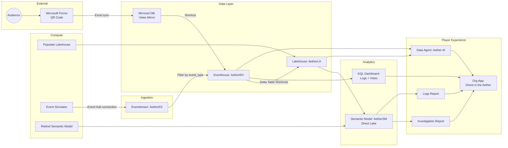
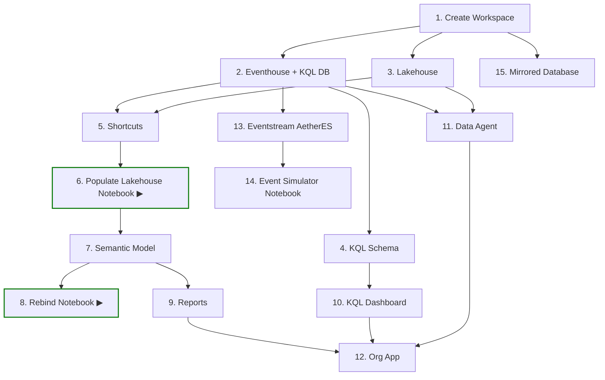

# Ghost in the Aether

> A murder mystery game built entirely on Microsoft Fabric. Players investigate a tech billionaire's death using Power BI reports, real-time log analysis, and an AI assistant that retrieves facts but never accuses.

## Prerequisites

| Requirement | Notes |
|-------------|-------|
| **Microsoft Fabric capacity** | F2 or higher (or Trial capacity) |
| **Azure CLI** | `az` installed and authenticated (`az login`) |
| **PowerShell 7+** | Cross-platform; ships with Windows |
| **Fabric permissions** | Ability to create workspaces on the target capacity |
| **Public repo (for images)** | Character portraits are served from `raw.githubusercontent.com`, so the repo (or your fork) must be **public** for images to render. See [Character Images](#character-images). |
| **Microsoft Forms** | A public form for audience voting (optional) |

## Deployment

The included `deploy.ps1` script creates the core Fabric items in the correct dependency order using the Fabric REST API. A small amount of post-deployment portal setup is still required for Open Mirroring.

### Quick Start

```powershell
# Clone the repo
git clone https://github.com/MitchSS/FabricMystery.git
cd FabricMystery

# Deploy to a new workspace (uses your existing az login session)
.\deploy.ps1 -WorkspaceName "Fabric Mystery Demo" -CapacityId "<your-capacity-guid>"
```

### Parameters

| Parameter | Required | Default | Description |
|-----------|----------|---------|-------------|
| `-WorkspaceName` | No | `"Fabric Mystery UG"` | Target workspace name. Created if it doesn't exist. |
| `-CapacityId` | No* | `""` | Fabric capacity GUID. *Required when creating a new workspace. |

### What the Script Does (14 Steps)

| Step | Action |
|------|--------|
| 1 | Create or resolve workspace |
| 2 | Create Eventhouse + KQL Database (`AetherEH`) |
| 3 | Create Lakehouse (`AetherLH`) |
| 4 | Deploy KQL schema (SecurityLogs, Communications, VictimCalendar, SupplierRecords, Votes) |
| 5 | Create Delta Table shortcuts (Eventhouse → Lakehouse) |
| 6 | Deploy & run Populate Lakehouse notebook (dimension data) |
| 7 | Deploy Semantic Model (`AetherSM` — Direct Lake) |
| 8 | Deploy & run Rebind Semantic Model notebook |
| 9 | Deploy Reports (`Aether Investigation`, `Logs`) — rebound to the deployed Semantic Model |
| 10 | Deploy KQL Dashboard (Security Logs, Communications, Audience Votes) |
| 11 | Deploy Data Agent (`AetherDA`) |
| 12 | Deploy Org App (`Aether App`) |
| 13 | Deploy Eventstream (`AetherES`) + auto-fetch Event Hub connection string |
| 14 | Deploy Event Simulator notebook (connection string injected automatically) |
| 15 | Create Mirrored Database (Votes Mirror) |

### Post-Deployment Setup

Once the script completes:

1. **Event Simulator** — The Event Hub connection string is injected automatically from the `AetherES` Eventstream during deployment, so no manual configuration is needed. Just open the notebook in Fabric and run it to start streaming events. (To point it at a different Event Hub for a manual run, set the `AETHER_EVENTHUB_CONNECTION_STRING` environment variable, which overrides the injected value.)

2. **Audience Voting (Open Mirroring)** — Set up the live voting pipeline:
   1. Create a public Microsoft Form with:
      - Question 1: "Who did it?" (choice: Evelyn Reed, Marcus Thorne, Anya Sharma, Dr. Alistair Finch)
      - Question 2: "Confidence?" (rating 1–5)
      - Question 3: "What was the motive?" (free text)
   2. In Forms settings, enable "Sync responses to Excel" (saves to OneDrive)
   3. In the Fabric portal, open "Votes Mirror" → configure the landing zone to read from the OneDrive Excel file
   4. Create a shortcut in the AetherEH KQL Database pointing to the mirrored `Votes` table
   5. Submit a test response and verify it appears in the KQL Dashboard's "Audience Votes" page

3. **Open the App** — Navigate to the workspace in the Fabric portal and launch "Aether App" for the player experience.

## Character Images

Character portraits (and the Aetherium Estate image) live in this repo under `images/` and are referenced by URL rather than embedded in the data:

| Asset | Location |
|-------|----------|
| Character portraits | `images/persons/*.png` |
| Estate image | `images/locations/aetherium-estate.png` |

The **Populate Lakehouse** notebook (step 6) writes these as `raw.githubusercontent.com` URLs into the `dimperson.ImageURL` column. Because the column is tagged with the `ImageUrl` data category, the Semantic Model and the Investigation Report render the portraits directly from the data.

> **The repo must be public for images to render.** `raw.githubusercontent.com` URLs return `404` for anonymous requests against a private repo, so Power BI can't fetch them. If you fork the project, update the `IMG_BASE` URL in the Populate Lakehouse notebook to point at your fork/branch.

## Redeployment & Cleanup

The script does **not** support incremental updates — it expects a fresh workspace. To redeploy:

```powershell
# Delete the workspace in the Fabric portal (or via API), then re-run:
.\deploy.ps1 -WorkspaceName "Fabric Mystery Demo" -CapacityId "<your-capacity-guid>"
```

## Troubleshooting

| Issue | Fix |
|-------|-----|
| `az rest` returns 401 | Run `az login` to refresh your token |
| Workspace creation fails | Ensure you have capacity admin rights and the `-CapacityId` is correct |
| Notebook job times out | Check capacity isn't throttled; default timeout is 10 minutes |
| Shortcuts fail | Eventhouse must be fully provisioned (script waits 5s, but busy capacities may need longer) |
| Character images don't render | The repo (or your fork) must be **public** — `raw.githubusercontent.com` URLs 404 for private repos. Also confirm `IMG_BASE` in the Populate Lakehouse notebook points at the correct fork/branch. |
| Audience Votes page is empty | Verify Forms is syncing to Excel, "Votes Mirror" is configured, and the Eventhouse shortcut points to the mirrored `Votes` table |

## Architecture



## Deployment Dependencies



> ▶ indicates notebooks that are executed during deployment. All other notebooks are deployed but run manually by the presenter.
