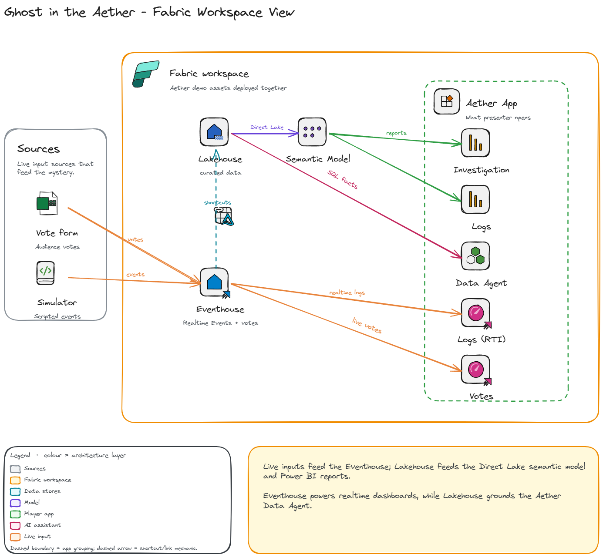

# Ghost in the Aether

> A murder mystery game built entirely on Microsoft Fabric. Players investigate a tech billionaire's death using Power BI reports, real-time log analysis, and an AI assistant that retrieves facts but never accuses.

## Presentation

The companion speaker deck, [GhostInTheAether.pptx](GhostInTheAether.pptx), provides the complete session flow: investigation setup, audience voting checkpoints, realtime and enriched clues, Ask Aether prompts, architecture, reusable industry patterns, and the final reveal.

## Prerequisites

| Requirement | Notes |
|-------------|-------|
| **Microsoft Fabric capacity** | F2 or higher (or Trial capacity) |
| **Azure CLI** | `az` installed and authenticated (`az login`) |
| **PowerShell 7+** | Cross-platform; ships with Windows |
| **Fabric permissions** | Ability to create workspaces on the target capacity |
| **Azure subscription** | Rights to create a resource group + Logic App (Consumption) for audience voting |
| **Public repo (for images)** | Character portraits are served from `raw.githubusercontent.com`, so the repo (or your fork) must be **public** for images to render. See [Character Images](#character-images). |
| **Microsoft Forms** | A public form for audience voting (optional) |

### Pre-deployment (Audience Votes form)

If you want a full end-to-end deployment of Audience Votes, create the Microsoft Form before running `deploy.ps1` and use these exact questions/options:

1. **Vote Section** (required)
   - Section 1
   - Section 2
   - Section 3
   - Final Vote
2. **Suspect** (required)
   - Evelyn Reed
   - Marcus Thorne
   - Anya Sharma
   - Dr. Alistair Finch
   - No one right now

Then pass `-VotesFormId`, `-VotesSuspectQuestionId`, and `-VotesVoteSectionQuestionId` to `deploy.ps1`.

## Deployment

The included `deploy.ps1` script creates the core Fabric items in the correct dependency order using the Fabric REST API. It also deploys an Azure Logic App (Consumption) that streams Microsoft Forms votes into the Eventhouse. A small amount of post-deployment portal setup (authorizing the Forms connection) is still required.

### Quick Start

```powershell
# Clone the repo
git clone https://github.com/MitchSS/FabricMystery.git
cd FabricMystery

# Deploy to a new workspace (uses your existing az login session)
.\deploy.ps1 -WorkspaceName "Fabric Mystery Demo" -CapacityId "<your-capacity-guid>"

# Full end-to-end deploy (includes Audience Votes wiring)
.\deploy.ps1 `
  -WorkspaceName "Fabric Mystery Demo" `
  -CapacityId "<your-capacity-guid>" `
  -VotesFormId "<forms-long-id>" `
  -VotesSuspectQuestionId "<suspect-question-id>" `
  -VotesVoteSectionQuestionId "<vote-section-question-id>"
```

### Parameters

| Parameter | Required | Default | Description |
|-----------|----------|---------|-------------|
| `-WorkspaceName` | No | `"Fabric Mystery UG"` | Target workspace name. Created if it doesn't exist. |
| `-CapacityId` | No* | `""` | Fabric capacity GUID. *Required when creating a new workspace. |
| `-ResourceGroup` | No | `"rg-fabricmystery"` | Azure resource group for the Audience Votes Logic App. Created if it doesn't exist. |
| `-Region` | No | `"uksouth"` | Azure region for the Logic App and its API connections. |
| `-VotesFormId` | No** | `""` | Microsoft Forms form id (long id from the form edit URL). **Required for full end-to-end deployment of Audience Votes.** If omitted, Logic App deployment is skipped. |
| `-VotesSuspectQuestionId` | No** | `""` | Forms question id for the Suspect vote. **Required for full end-to-end Audience Votes wiring.** |
| `-VotesVoteSectionQuestionId` | No** | `""` | Forms question id for the Vote Section / voting round (e.g. "Final Vote"). **Required for full end-to-end Audience Votes wiring.** |
| `-VotesNameQuestionId` | No | `""` | *Optional / unused by the demo form.* Forms question id for a voter Name. Left blank, votes are recorded as `anonymous`. |

> \* `-CapacityId` is required when creating a new workspace.
>
> \** `-VotesFormId`, `-VotesSuspectQuestionId`, and `-VotesVoteSectionQuestionId` are required only if you want Audience Votes fully configured during deployment (no post-deploy parameter editing).

### What the Script Does (16 Steps)

| Step | Action |
|------|--------|
| 1 | Create or resolve workspace |
| 2 | Create Eventhouse + KQL Database (`AetherEH`) |
| 3 | Create Lakehouse (`AetherLH`) |
| 4 | Deploy KQL schema (SecurityLogs, Communications, VictimCalendar, SupplierRecords, Votes) |
| 5 | Create Delta Table shortcuts (Eventhouse → Lakehouse) |
| 6 | Deploy & run Populate Lakehouse notebook (dimension data) |
| 7 | Deploy Semantic Model (`AetherSM` — Direct Lake) |
| 8 | Deploy & run Rebind Semantic Model notebook |
| 9 | Deploy Reports (`Aether Investigation`, `Logs`) — rebound to the deployed Semantic Model |
| 10 | Deploy KQL Dashboards — `Logs` (Security Logs, Communications) and `Audience Votes` (its own dashboard) |
| 11 | Deploy Data Agent (`AetherDA`) |
| 12 | Deploy Org App (`Aether App`) |
| 13 | Deploy Eventstream (`AetherES`) + auto-fetch Event Hub connection string |
| 14 | Deploy Event Simulator notebook (connection string injected automatically) |
| 15 | Deploy Housekeeping notebook (pre-show reset of the `Votes` table) |
| 16 | Deploy Audience Votes Logic App (MS Form → Eventstream → `Votes` table) |

### Post-Deployment Setup

Once the script completes:

1. **Event Simulator** — The Event Hub connection string is injected automatically from the `AetherES` Eventstream during deployment, so no manual configuration is needed. Just open the notebook in Fabric and run it to start streaming events. (To point it at a different Event Hub for a manual run, set the `AETHER_EVENTHUB_CONNECTION_STRING` environment variable, which overrides the injected value.)

2. **Audience Voting (Real-Time via Logic App)** — The live voting pipeline uses a Microsoft Form → Azure Logic App → Eventstream → Eventhouse `Votes` table → `Audience Votes` dashboard. This pattern is credited to [liamhowlett/fabric-rti-livesurvey](https://github.com/liamhowlett/fabric-rti-livesurvey).

   The Logic App (`aether-votes-logicapp`) is deployed fully wired **except** for the form-specific values it reads as workflow parameters. You supply these once — either through the portal (below) or by re-running `deploy.ps1` with the matching switches. If `-VotesFormId` is omitted, the script skips Logic App deployment to avoid publishing a broken Forms trigger.
   
   > Privacy note: `deploy.ps1` uses only values passed via `-Votes*` parameters and does **not** read/reuse existing Form/question IDs from an already deployed Logic App.

   | Parameter | What it is | `deploy.ps1` switch |
   |-----------|------------|---------------------|
   | `formId` | The long id of **your** Microsoft Form (not the `/r/…` short link). | `-VotesFormId` |
   | `suspectQuestionId` | The Forms question id (e.g. `r8a1c…`) for the **Suspect** question ("Who did it?"). | `-VotesSuspectQuestionId` |
   | `voteSectionQuestionId` | The Forms question id for the **Vote Section** question (the voting round, e.g. "Final Vote"). | `-VotesVoteSectionQuestionId` |
   | `nameQuestionId` | *Optional / unused by the demo form.* If your form has a name question, its id goes here. Left blank, votes are recorded as `anonymous`. | `-VotesNameQuestionId` |

   Forms' *Get response details* returns answers keyed by **question id**, not friendly names, and you can't know those ids until one response exists — so the reliable order is: set the form id → authorize → submit one test → read the ids from the run → paste them in.

   1. **Create the form.** Two questions:
      - **Vote Section** — choices: Section 1, Section 2, Section 3, Final Vote.
      - **Suspect** — choices: Evelyn Reed, Marcus Thorne, Anya Sharma, Dr. Alistair Finch, No one right now.

      Set the form to **accept anonymous responses** ("Anyone can respond" — no sign-in required), so audience members can vote from any device without a Microsoft account. Because there's no name question, votes are stored with `VoterName = anonymous`.
   2. **Get the form id.** Open the form in the Forms editor; in the browser URL, copy the value between `id=` and the next `&`. That's `formId`.
   3. **Authorize the connection.** Azure portal → resource group (`rg-fabricmystery`) → API connection **`aether-forms`** → **Edit API connection** → **Authorize** → sign in → **Save**. (One-time Microsoft Forms OAuth consent. This is *you* — the form owner — authorizing the Logic App to read responses; it does **not** require voters to sign in.)
   4. **Set the form id.** Open the **`aether-votes-logicapp`** Logic App → **Logic app designer** → **Parameters** → set **`formId`** → **Save**. The trigger only registers its webhook once `formId` is set.
   5. **Submit one test response** to the form.
   6. **Read the question ids.** Logic App → **Run history** → open the latest run → expand **Get response details** → **Outputs** → `body`. You'll see pairs like `"r8a1c…": "Dr. Alistair Finch"`. The key whose value is the chosen **suspect** is `suspectQuestionId`; the key whose value is the **vote section** is `voteSectionQuestionId`.
   7. **Set the ids.** Back in **Parameters**, paste them into **`suspectQuestionId`** and **`voteSectionQuestionId`** → **Save**.
   8. **Verify.** Submit another response and confirm it lands in the Eventhouse `Votes` table and appears on the "Audience Votes" dashboard.

   > Shortcut: once you know both question ids, you can instead re-run `deploy.ps1 -VotesFormId <id> -VotesSuspectQuestionId <id> -VotesVoteSectionQuestionId <id>` and skip the portal editing entirely.

3. **Open the App** — Navigate to the workspace in the Fabric portal and launch "Aether App" for the player experience.

4. **Reset Between Shows (Housekeeping)** — Run the **Housekeeping** notebook before each presentation to clear the previous run's audience votes so the dashboards start clean. It auto-resolves the `AetherEH` cluster URI from the current workspace (zero config), shows row counts before/after, and runs `.clear table Votes data` (deletes rows, keeps schema — the Eventstream keeps writing and tiles keep working).

   - Defaults to clearing the `Votes` table only.
   - Set `RESET_DEMO_DATA = True` in the config cell to also clear the streamed `SecurityLogs` and `Communications` tables (useful before re-running the Event Simulator). Reference tables (`VictimCalendar`, `SupplierRecords`) are left untouched.
   - Clear right at showtime: votes still buffered in the Event Hub / Eventstream land *after* the clear, so let in-flight submissions drain (or briefly pause the Eventstream source) first.

## Character Images

Character portraits (and the Aetherium Estate image) live in this repo under `images/` and are referenced by URL rather than embedded in the data:

| Asset | Location |
|-------|----------|
| Character portraits | `images/persons/*.png` |
| Estate image | `images/locations/aetherium-estate.png` |

The **Populate Lakehouse** notebook (step 6) writes these as `raw.githubusercontent.com` URLs into the `dimperson.ImageURL` column. Because the column is tagged with the `ImageUrl` data category, the Semantic Model and the Investigation Report render the portraits directly from the data.

> **The repo must be public for images to render.** `raw.githubusercontent.com` URLs return `404` for anonymous requests against a private repo, so Power BI can't fetch them. If you fork the project, update the `IMG_BASE` URL in the Populate Lakehouse notebook to point at your fork/branch.

## Redeployment & Cleanup

The script is **idempotent** — you can re-run it against an existing workspace to push local changes. Items that already exist are updated in place (via `updateDefinition`) rather than duplicated, existing OneLake shortcuts are skipped, and the KQL schema uses `.create-merge`/`.alter-merge`. Re-running also re-runs the Populate Lakehouse and Rebind notebooks.

The four utility notebooks (Populate Lakehouse, Rebind Semantic Model, Event Simulator, Housekeeping) are grouped into an **Admin** folder in the workspace — mirroring the repo's `Admin\` layout — so the "show" items (reports, dashboards, semantic model, Eventhouse, etc.) stay uncluttered at the root. The folder is created automatically and notebooks are moved into it on every run. The Eventstream (`AetherES`) is treated as **create-only** on re-run: its definition is left untouched so its Event Hub connection string can't rotate and break the live Audience Votes Logic App binding.

```powershell
# Re-run to update an already-deployed workspace with local changes:
.\deploy.ps1 -WorkspaceName "Fabric Mystery Demo"
```

For a completely clean slate, delete the workspace in the Fabric portal (or via API) first, then run with `-CapacityId`:

```powershell
.\deploy.ps1 -WorkspaceName "Fabric Mystery Demo" -CapacityId "<your-capacity-guid>"
```

## Troubleshooting

| Issue | Fix |
|-------|-----|
| `az rest` returns 401 | Run `az login` to refresh your token |
| Workspace creation fails | Ensure you have capacity admin rights and the `-CapacityId` is correct |
| Notebook job times out | Check capacity isn't throttled; default timeout is 10 minutes |
| Shortcuts fail | Eventhouse must be fully provisioned (script waits 5s, but busy capacities may need longer) |
| Character images don't render | The repo (or your fork) must be **public** — `raw.githubusercontent.com` URLs 404 for private repos. Also confirm `IMG_BASE` in the Populate Lakehouse notebook points at the correct fork/branch. |
| Audience Votes dashboard is empty | Verify the `aether-forms` API connection is authorized, the Logic App run history shows successful runs, and events are reaching the Eventhouse `Votes` table |

## Architecture


